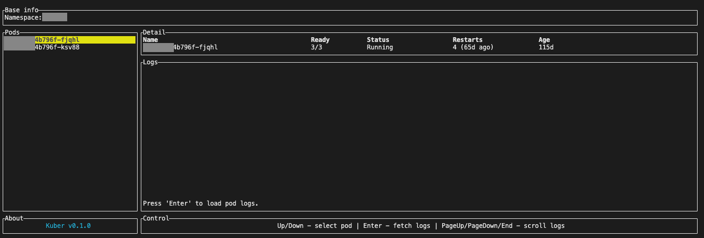

# Kuber

CLI application for browsing kubernetes cluster. Right now it is able to show pods list, basic pod details and logs. 



## How to run

Kuber is written in Rust, so to build it from the source you need the Rust itself. Here is the instruction how to download it: [instruction](https://doc.rust-lang.org/book/ch01-01-installation.html#installation)

Under the hood Kuber uses 'kubectl' and connects to it's default cluster. So, it is required to have configured 'kubectl' on the PATH first.

Then use 
```bash
cargo run
```
to connect to the default k8s namespace, or:
```bash
cargo run -- -n <namespace>
```
to connect to a different 'namespace'.

<br>
<br>

To build optimized 'single-binary' file use:
```bash
cargo build --release
```
Compiled file will be under ./target/release.

